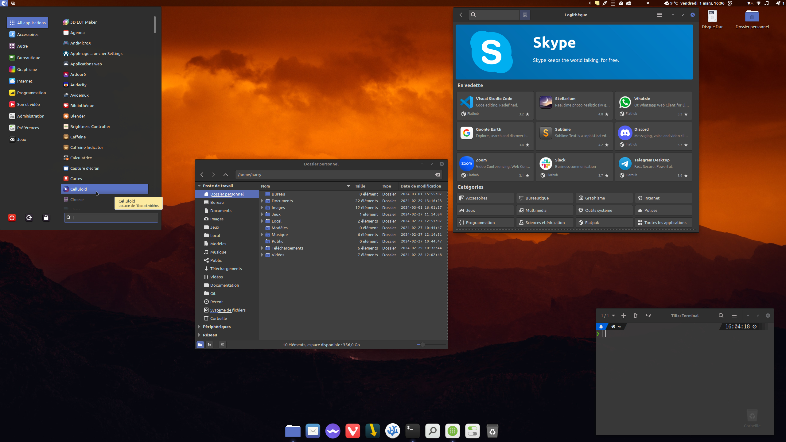

# Mintage

<figure>
  
</figure>

Ce petit projet est conçu pour automatiser le processus de personnalisation de Linux Mint en installant une suite complète de logiciels open source. De manière simple, les utilisateurs peuvent transformer leur système Linux Mint en un environnement de travail puissant et personnalisé, idéal pour les développeurs, les créateurs de contenu et (bien évidemment) les utilisateurs quotidiens.

## Présentation

<details style="background-color: #222222; border: 1px solid #ccc; border-radius: 4px;">
<summary>Afficher/Masquer</summary>

### Fonctionnalités

- **Installation Automatique** : Déployez votre environnement personnalisé sans intervention manuelle.
- **Suite Complète** : Le script inclut des logiciels pour le développement, la bureautique, le multimédia, et plus encore.
- **Open Source** : Tous les logiciels installés sont open source, garantissant transparence et respect de la vie privée.
- **Thème Préconfiguré** : Profitez d'un thème sobre et fonctionnel, conçu pour une expérience utilisateur optimale.

### Liste de logiciels

Une liste non exhaustive des logiciels inclus dans ce script :

- **Développement**: Codium, Git, Docker
- **Bureautique**: LibreOffice, Thunderbird
- **Multimédia**: GIMP, Kodi
- **Internet**: Vivaldi, FileZilla
- ...et beaucoup d'autres !

Vous pouvez aussi consulter [la liste complète](./DATA/complete-list.md).

### Contributions

Les contributions sont les bienvenues ! Si vous avez des suggestions ou des améliorations, n'hésitez pas à soumettre une pull request ou à ouvrir une issue.

### License

Distribué sous la licence GPLv3. Voir `LICENSE` pour plus d'informations.

</details>

---

## Prérequis

<details style="background-color: #222222; border: 1px solid #ccc; border-radius: 4px;">
<summary>Afficher/Masquer</summary>

Une clean install de [Linux Mint 21.3 x86_64](https://www.linuxmint.com) est nécessaire.
Pour info pour coller dans le terminal il faut utiliser `CTRL + SHIFT + V` et pour copier `CTRL + SHIFT + C`.
`CTRL + C` sert à quitter dans le terminal.

Choisir les miroirs de téléchargement pour les mises à jour (prenez les plus rapides)
Pour ouvrir le terminal : `CTRL + ALT + T`

```bash
/usr/bin/software-properties-gtk
```

Ensuite choisissez les drivers

```bash
driver-manager
```

Installez les drivers propriétaires et "Appliquer les changements", puis fermez.

Faire les mise à jour

```bash
mintupdate
```

Et installer nala, une surcouche du gestionnaire apt

```bash
# Nala
sudo apt install -y nala expect curl wget
# puis changer les miroir de dl avec :
sudo nala fetch
# en répondant "2 3 4" sans oublier les espaces entre eux
# ou plus simplement (mais semble ne pas toujours marcher)
echo -e "2 3 4\nY" | sudo nala fetch
```

Il y a une source défaillante chez moi "linuxmirrors.ir", c'est pour ça que c'est "2 3 4" et non "1 2 3"
Si vous avez besoin de gérer les sources (inutile ici) ouvrez "Gestionnaire de mises à jour" et allez dans "Edition/Sources de logiciels", allez ensuite dans "Dépôts supplémentaires" et décochez la ou les sources en question.

### Téléchargement

Depuis le terminal, on télécharge [la dernière release](https://github.com/RogerBytes/Mintage/releases/latest) et on la décompresse :

```bash
latest_url=$(curl -sL -w '%{url_effective}\n' https://github.com/RogerBytes/Mintage/releases/latest -o /dev/null)
download_url="${latest_url/tag\/v/download/v}/Mintage-${latest_url##*/}.tar.gz"
wget $download_url
file=$(find . -name 'Mintage*.tar.gz' -print -quit)
tar -xvf "$file"
folder_name=$(tar -tf "$file" | head -1 | cut -f1 -d"/")
rm $file

```

</details>

---

## Installation

<details style="background-color: #222222; border: 1px solid #ccc; border-radius: 4px;">
<summary>Afficher/Masquer</summary>

### Installation scriptée

Dans le terminal, dans le dossier extrait depuis l'archive (l'on y est déjà après avoir fait les prérequis)

```bash
cd $HOME/Mintage/ && ./prerequis.sh
```

Puis dans un nouveau terminal :

```bash
cd $HOME/Mintage/ && ./install.sh
```

Puis faire un reboot.
Après le redémarrage lancez Jdownloader et Thunderbird une première fois, puis fermez les tous.

Ensuite, lancez :

```bash
cd $HOME/Mintage/ && ./after-reboot.sh
```

### Installations manuelles

#### Grub Cutomizer

Si Dual-Boot seulement !
Dans un terminal :

```bash
grub-customizer
```

Dans Grub customizer mettez "calmgrub" comme thème avec l’icône de "+" dans l'onglet "apparence" (mettez calmgrub.tar.gz qui se trouve dans /racine du système) faites "appliquer" et enregistrez.

#### Gestionnaire de mises à jour

Dans "Gestionnaire de mises à jour" allez dans "Édition/Préférences", allez dans l'onglet "Paquet" et cochez les maj cinnamon et flatpak, ensuite allez dans l'onglet "Automatisation" et cochez tout sauf le dernier "Retirer les noyaux obsolètes et leurs dépendances".

#### Dual Boot avec Windows

Si Dual-Boot seulement !

Dans un terminal :

```bash
gnome-disks
```

Trouvez le disque où est installé Windows, puis chez la partition NTFS où il se trouve, sélectionnez-le puis cliquez
sur la petite roue de paramétrage. Choisissez l'option "modifier les options de montage",
Décochez "Réglages par défaut de la session" et décochez tout puis faîtes "Valider.

Attention, si vous avez un dual boot avec windows, il faut ABSOLUMENT que vous désactiviez le fastboot sur votre session windows, sinon les autres disques ne seront jamais démontés correctement de la session windows (bravo microsoft pour cet éclair de génie).
[Désactiver le démarrage rapide de windows](https://www.malekal.com/desactiver-demarrage-rapide-windows-10-11/)

#### Appimages

Depuis le dossier caché `~/Applications` (qui sert à un gestionnaire pour stocker les appimages) lancez chacune des applications.

#### Jdownloader

Ouvrez Jdownloader, allez dans paramètres/général et mettez votre nom d'utilisateur à la place de "harry" dans le chemin de téléchargement par défaut (premier de la liste)

#### LanguageTools pour LibreOffice

Téléchargez l'extension via wget (dl direct)

```bash
wget https://languagetool.org/download/LanguageTool-stable.oxt
```

Dans LibreOffice allez dans "Outils/Gestionnaire des extensions..."
Puis "Ajouter" et choisir "LanguageTool-stable.oxt"
Dans LibreOffice aller dans "Outils/Options" (ou 'Alt+F12'), puis :
"Paramètres linguistiques/Linguistique"
Allez dans l'encart "Modules linguistiques disponibles", puis :
Décochez "Vérificateur orthographique Hunspell"

#### Derniers réglages

Sinon sur votre bureau 'clic droit' > personnaliser :
décochez "ajustement automatique", puis cliquez en bas sur "Paramètre du bureau"
Décochez le poste de travail et cochez le dossier personnel

Lancez Xpad une première fois depuis le menu.

Clic droit sur l’icône "préférences" dans l'onglet "au démarrage, cochez "Démarrer Xpad automatiquement après l'ouverture de session".

Pour lancer une détection des capteurs thermiques et autres :

```bash
sudo sensors-detect
```

### Installation terminée

Dans votre dossier utilisateur se trouve le dossier Mintage : vous pouvez maintenant le supprimer.
Une documentation avec plein de conseils et astuces se trouve dans `~/Local/Documentation`.

Votre installation est terminée, amusez-vous bien sur Linux Mint !

</details>

---

## Todo

<details style="background-color: #222222; border: 1px solid #ccc; border-radius: 4px;">
<summary>Afficher/Masquer</summary>

1. Faire un script de customisation pour une nouvelle session.
2. Faire une application simple pour changer de runtime Java.
3. Ajouter quelques jeux gratuits/open source à Documentation

</details>

---

## Dernier rapport

<details style="background-color: #222222; border: 1px solid #ccc; border-radius: 4px;">
<summary>Afficher/Masquer</summary>

### Problèmes

RAS - a test changements

### Observations

Après qt5ct (juste après game feral mode et powerlevel de zsh) Système demande à relancer cinnamon. Et dans le shell il demande le mdp dans le terminal sans rien faire derrière (je pense que c'est pour mintupdate mais pas sûr).

#### Les paquets (remis) qui sautent durant l'installation avec le update

- blueman
- caffeine
- psensor
- transmission-gtk

#### Les appli flatpak sans support de thème

- Ciano - Compression et conversion de fichiers audio et vidéo
- Mousai - io.github.seadve.Mousai
- Téléchargeur de vidéo - com.github.unrud.VideoDownloader

</details>

---

## Auteurs

- [Harry RICHMOND](https://github.com/RogerBytes)
